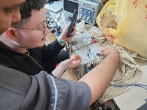

# Nabdh: Vital Signs Monitoring Prototype

**Nabdh** (Arabic for "Pulse") is an embedded physiological monitoring prototype designed to measure, process, and display vital signs in real-time. The system integrates biomedical sensors with a microcontroller backend to acquire physiological data, process the signals, and output the results to a user-facing LCD. 

This project was developed to address the need for accessible, locally manufacturable medical instrumentation. The hardware enclosure was custom-designed and 3D-printed to ensure portability and robustness during field testing.

## Awards and Recognition

**First Place - Hackathon of Innovation for Local Solutions using Smart Manufacturing Technologies**  
*University of Science and Technology (UST) Aden, February 2026*

The project was awarded first place among competing engineering projects for its functional prototype, integration of smart manufacturing (3D printing), and direct applicability to local healthcare challenges.

## Rapid Prototyping & System Architecture

Due to the strict time constraints of the Hackathon, the hardware architecture was designed utilizing reliable off-the-shelf sensor modules to accelerate the proof-of-concept phase, focusing engineering efforts on integration, embedded software, and product design.

The system consists of three primary stages:
1. **Signal Acquisition:** 
   * **ECG Acquisition:** Utilized the AD8232 single-lead heart rate monitor front-end module.
   * **Photoplethysmography (PPG):** Utilized a MAX sensor module (e.g., MAX30102) for pulse and potential SpO2 derivation.
2. **Processing Unit:** An embedded microcontroller digitizes the analog inputs, applies digital filtering algorithms to remove baseline wander and high-frequency noise, and extracts clinical parameters (e.g., heart rate).
3. **User Interface:** A compact LCD screen provides real-time visualization of the processed vital signs.

### Breadboard Assembly and Testing
During the hackathon, the sensor integration and embedded C/C++ firmware were iteratively tested on a breadboard setup with live human subjects and validated using an oscilloscope before finalizing the 3D-printed enclosure.

## Hardware Demonstration & Live Testing

Watch the live hardware demonstration of the Nabdh prototype measuring vital signs and validating real-time sensor responsiveness during subject testing:

🔗 **YouTube Video Demo:** [Watch on YouTube (Testing on Subject)](https://youtu.be/_p6Nn98H_nc)

## Clinical and Engineering Relevance

This prototype demonstrates practical competency in several core areas of Biomedical Engineering:
* **Biosensor Interfacing:** Rapidly integrating analog front-ends (AD8232) and digital sensors (MAX30102) with microcontrollers.
* **Embedded Systems:** Writing deterministic, low-latency code for real-time signal processing and UI management.
* **Rapid Prototyping:** Utilizing CAD and 3D printing for medical device packaging under severe time constraints.

*Note: This repository serves as an academic portfolio showcase of the hardware prototype and testing documentation.*
