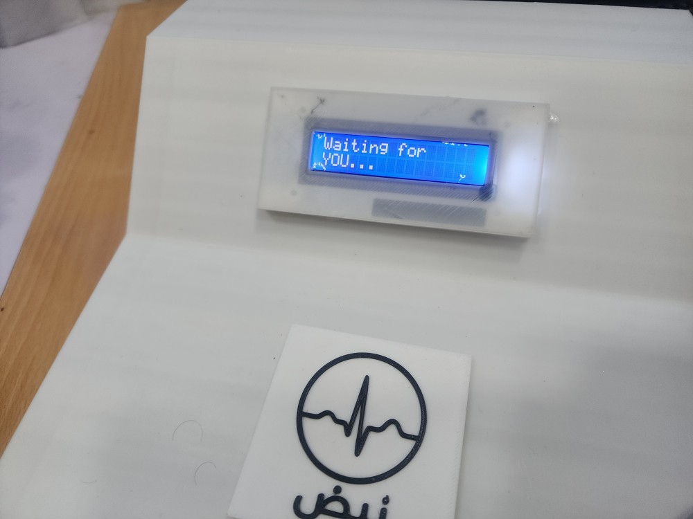
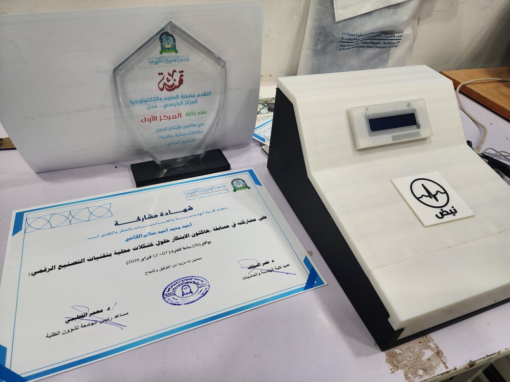
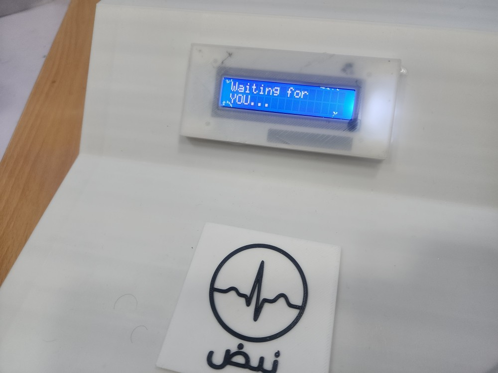

# Nabdh: Vital Signs Monitoring Prototype

**Nabdh** (Arabic for "Pulse") is an embedded physiological monitoring prototype designed to measure, process, and display vital signs in real-time. The system integrates biomedical sensors with a microcontroller backend to acquire physiological data, process the signals, and output the results to a user-facing LCD. 

This project was developed to address the need for accessible, locally manufacturable medical instrumentation. The hardware enclosure was custom-designed and 3D-printed to ensure portability and robustness during field testing.

## Awards and Recognition

**First Place - Hackathon of Innovation for Local Solutions using Smart Manufacturing Technologies**  
*University of Science and Technology (UST) Aden, February 2026*

The project was awarded first place among competing engineering projects for its functional prototype, integration of smart manufacturing (3D printing), and direct applicability to local healthcare challenges.

## System Architecture

The hardware architecture of Nabdh consists of three primary stages:
1. **Signal Acquisition:** Analog front-end sensors capture raw physiological signals.
2. **Processing Unit:** An embedded microcontroller digitizes the analog inputs, applies digital filtering algorithms to remove baseline wander and high-frequency noise, and extracts clinical parameters (e.g., heart rate).
3. **User Interface:** A compact LCD screen provides real-time visualization of the processed vital signs.

## Hardware Demonstration

*A video demonstration of the prototype in operation, validating sensor responsiveness and real-time processing capabilities, is available in the repository (`assets/nabdh.mp4`).*

## Clinical and Engineering Relevance

This prototype demonstrates practical competency in several core areas of Biomedical Engineering:
* **Biosensor Interfacing:** Managing signal-to-noise ratio (SNR) in physical hardware.
* **Embedded Systems:** Writing deterministic, low-latency code for real-time signal processing.
* **Rapid Prototyping:** Utilizing CAD and 3D printing for medical device packaging.

*Note: This repository serves as a portfolio demonstration of the hardware prototype and its associated documentation.*
